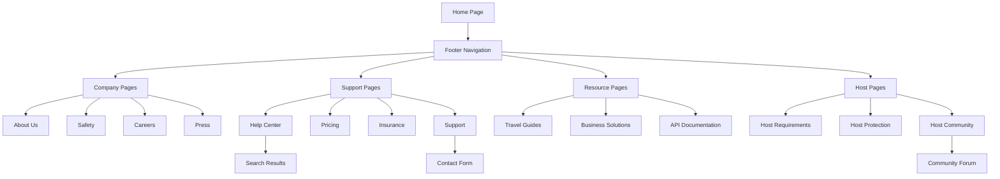

# MobiRides Missing Pages Implementation Plan

## 1. Product Overview

This document outlines the comprehensive implementation plan for generating 16 missing pages for the MobiRides landing page footer navigation. The implementation will create a complete site architecture supporting MobiRides' car sharing business model in Botswana, organized across 4 strategic phases to ensure systematic development and consistent user experience.

## 2. Core Features

### 2.1 User Roles

| Role | Registration Method | Core Permissions |
|------|---------------------|------------------|
| Guest User | No registration required | Can browse all public pages, view pricing, read guides |
| Registered User | Email registration via app | Can access support tickets, personalized content |
| Host User | Vehicle verification process | Can access host-specific pages, community features |
| Business User | Corporate partnership application | Can access enterprise solutions, API documentation |

### 2.2 Feature Module

Our missing pages implementation consists of the following main page categories:

1. **Company Pages**: About Us, Safety, Careers, Press - establishing brand credibility and transparency
2. **Support & Information Pages**: Help Center, Pricing, Insurance, Support - providing comprehensive user assistance
3. **Resource Pages**: Travel Guides, Business Solutions, API Documentation - offering value-added services
4. **Host-Specific Pages**: Host Requirements, Host Protection, Host Community - supporting the host ecosystem

### 2.3 Page Details

| Page Name | Module Name | Feature Description |
|-----------|-------------|---------------------|
| About Us | Company Story | Display company mission, vision, team profiles, company values, and Botswana market focus |
| Safety | Safety Protocols | Present safety measures, insurance coverage, emergency procedures, and incident reporting |
| Careers | Job Listings | Show current openings, company culture, application process, and employee benefits |
| Press | Media Center | Provide press releases, media kit downloads, company news, and journalist contacts |
| Help Center | FAQ System | Offer searchable FAQ sections, troubleshooting guides, and contact options |
| Pricing | Rate Calculator | Display detailed pricing breakdown, comparison tables, and transparent fee structure |
| Insurance | Coverage Details | Explain insurance policies, claims process, coverage limits, and policy documents |
| Support | Contact System | Provide contact forms, live chat integration, and ticket system access |
| Travel Guides | Destination Content | Feature Botswana destinations, travel tips, local insights, and route recommendations |
| Business Solutions | Enterprise Services | Present corporate partnerships, fleet management, and enterprise pricing options |
| API Documentation | Developer Resources | Offer API endpoints, integration guides, code examples, and developer support |
| Host Requirements | Verification Process | Detail vehicle standards, driver requirements, and verification procedures |
| Host Protection | Host Insurance | Explain insurance coverage for hosts, damage policies, and dispute resolution |
| Host Community | Community Features | Provide forum access, host success stories, and networking event information |

## 3. Core Process

### User Navigation Flow

Users can access these pages through multiple entry points:
- Footer navigation links for all pages
- Header dropdown menus for categorized access
- Internal cross-linking between related pages
- Search functionality within Help Center
- Direct URL access for bookmarking

### Content Management Flow

Content updates follow a structured approach:
- Static content managed through React components
- Dynamic content (FAQ, job listings) managed through JSON data files
- Media assets stored in public/assets directory
- SEO metadata configured per page



## 4. User Interface Design

### 4.1 Design Style

- **Primary Colors**: Blue (#2563eb), Green (#16a34a) for CTAs
- **Secondary Colors**: Gray (#6b7280) for text, White (#ffffff) for backgrounds
- **Button Style**: Rounded corners (8px), solid and outline variants
- **Typography**: Inter font family, 16px base size, responsive scaling
- **Layout Style**: Card-based sections, consistent spacing (24px grid)
- **Icons**: Lucide React icons for consistency with existing pages

### 4.2 Page Design Overview

| Page Name | Module Name | UI Elements |
|-----------|-------------|-------------|
| About Us | Hero Section | Full-width hero with company mission, team photo grid, values cards with icons |
| Safety | Safety Protocols | Icon-based safety features, emergency contact cards, insurance badge display |
| Careers | Job Listings | Job card grid, filter sidebar, application form modal, company culture gallery |
| Press | Media Center | Press release timeline, downloadable media kit, news card layout |
| Help Center | FAQ System | Search bar, category filters, expandable FAQ items, contact widget |
| Pricing | Rate Calculator | Interactive pricing calculator, comparison table, transparent fee breakdown |
| Insurance | Coverage Details | Coverage comparison table, claims process timeline, policy document links |
| Support | Contact System | Multi-channel contact options, ticket form, live chat widget integration |
| Travel Guides | Destination Content | Destination cards with images, interactive map, travel tips accordion |
| Business Solutions | Enterprise Services | Feature comparison table, ROI calculator, partnership inquiry form |
| API Documentation | Developer Resources | Code syntax highlighting, interactive API explorer, endpoint documentation |
| Host Requirements | Verification Process | Step-by-step verification guide, requirement checklist, document upload area |
| Host Protection | Host Insurance | Coverage visualization, claim process flowchart, dispute resolution steps |
| Host Community | Community Features | Success story cards, event calendar, community forum integration |

### 4.3 Responsiveness

All pages are designed mobile-first with responsive breakpoints:
- Mobile: 320px - 768px (single column layout)
- Tablet: 768px - 1024px (two-column layout)
- Desktop: 1024px+ (multi-column layout with sidebars)
- Touch-optimized interactions for mobile devices
- Accessible navigation with keyboard support

## 5. Technical Architecture

### 5.1 Component Structure

```typescript
// Base page structure for all new pages
interface PageProps {
  title: string;
  description: string;
  canonical?: string;
  jsonLd?: object;
}

// Reusable components to be created
- FAQSection: Expandable FAQ component
- ContactForm: Multi-purpose contact form
- PricingCalculator: Interactive pricing tool
- TeamGrid: Team member display
- JobListing: Job posting component
- DocumentDownload: File download component
- CommunityForum: Forum integration component
```

### 5.2 Routing Configuration

New routes to be added to App.tsx:

```typescript
// Company Pages
<Route path="/about" element={<AboutPage />} />
<Route path="/safety" element={<SafetyPage />} />
<Route path="/careers" element={<CareersPage />} />
<Route path="/press" element={<PressPage />} />

// Support & Information Pages
<Route path="/help" element={<HelpCenterPage />} />
<Route path="/pricing" element={<PricingPage />} />
<Route path="/insurance" element={<InsurancePage />} />
<Route path="/support" element={<SupportPage />} />

// Resource Pages
<Route path="/travel-guides" element={<TravelGuidesPage />} />
<Route path="/business" element={<BusinessSolutionsPage />} />
<Route path="/api-docs" element={<ApiDocsPage />} />

// Host-Specific Pages
<Route path="/host-requirements" element={<HostRequirementsPage />} />
<Route path="/host-protection" element={<HostProtectionPage />} />
<Route path="/host-community" element={<HostCommunityPage />} />
```

### 5.3 Data Management

New JSON data files to be created:
- `src/data/team-members.json` - Team information
- `src/data/job-listings.json` - Career opportunities
- `src/data/press-releases.json` - Media content
- `src/data/faq-data.json` - FAQ content by category
- `src/data/travel-destinations.json` - Botswana destinations
- `src/data/api-endpoints.json` - API documentation

### 5.4 SEO Implementation

Each page will include:
- Unique meta titles and descriptions
- Open Graph tags for social sharing
- JSON-LD structured data
- Canonical URLs
- Sitemap integration

## 6. Implementation Phases

### Phase 1: Company Pages (Week 1)
**Priority: High** - Establishes brand credibility

1. **About Us Page**
   - Company story and mission section
   - Team member grid with photos and bios
   - Company values with icon representations
   - Botswana market focus explanation

2. **Safety Page**
   - Safety protocol overview
   - Insurance coverage details
   - Emergency procedures
   - Incident reporting system

3. **Careers Page**
   - Current job openings
   - Company culture showcase
   - Application process guide
   - Employee benefits overview

4. **Press Page**
   - Press release archive
   - Media kit downloads
   - Company news updates
   - Journalist contact information

### Phase 2: Support & Information Pages (Week 2)
**Priority: High** - Critical for user support

1. **Help Center Page**
   - Searchable FAQ system
   - Category-based organization
   - Troubleshooting guides
   - Contact escalation options

2. **Pricing Page**
   - Detailed rate breakdown
   - Interactive pricing calculator
   - Comparison tables
   - Transparent fee structure

3. **Insurance Page**
   - Coverage policy details
   - Claims process explanation
   - Policy document access
   - Coverage limit information

4. **Support Page**
   - Multi-channel contact options
   - Support ticket system
   - Live chat integration
   - Response time expectations

### Phase 3: Resource Pages (Week 3)
**Priority: Medium** - Value-added content

1. **Travel Guides Page**
   - Botswana destination highlights
   - Travel tips and recommendations
   - Local insights and culture
   - Route planning assistance

2. **Business Solutions Page**
   - Corporate partnership options
   - Fleet management services
   - Enterprise pricing tiers
   - ROI calculator for businesses

3. **API Documentation Page**
   - Developer resource center
   - API endpoint documentation
   - Integration guides and examples
   - SDK downloads and support

### Phase 4: Host-Specific Pages (Week 4)
**Priority: Medium** - Host ecosystem support

1. **Host Requirements Page**
   - Vehicle standard specifications
   - Driver requirement details
   - Verification process steps
   - Document submission guide

2. **Host Protection Page**
   - Host insurance coverage
   - Damage policy explanation
   - Dispute resolution process
   - Protection guarantee details

3. **Host Community Page**
   - Community forum access
   - Host success stories
   - Networking event calendar
   - Best practice sharing

## 7. Content Requirements

### 7.1 Content Strategy

- **Tone**: Professional yet approachable, reflecting Botswana's hospitality
- **Language**: English with occasional Setswana phrases for local connection
- **Focus**: Emphasize safety, reliability, and local expertise
- **SEO**: Target keywords related to car sharing, Botswana travel, and mobility

### 7.2 Content Sources

- Company information from existing marketing materials
- Legal requirements from Botswana transportation regulations
- Insurance details from policy documents
- Travel content from Botswana Tourism Board resources
- Technical documentation from development team

## 8. Quality Assurance

### 8.1 Testing Requirements

- Cross-browser compatibility testing
- Mobile responsiveness validation
- SEO audit and optimization
- Accessibility compliance (WCAG 2.1)
- Performance optimization testing

### 8.2 Content Review

- Legal compliance review for insurance and safety content
- Brand consistency check across all pages
- Fact-checking for Botswana-specific information
- User experience testing for navigation flow

## 9. Success Metrics

- Page load times under 3 seconds
- Mobile usability score above 95
- SEO score above 90 for all pages
- User engagement metrics (time on page, bounce rate)
- Conversion rates from information pages to app downloads

This comprehensive implementation plan ensures systematic development of all missing pages while maintaining consistency with existing design patterns and providing valuable content for MobiRides users in Botswana.