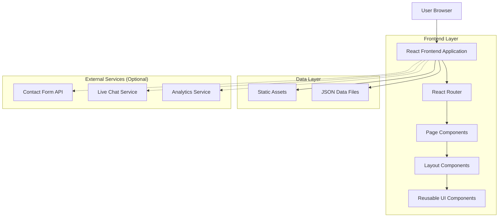
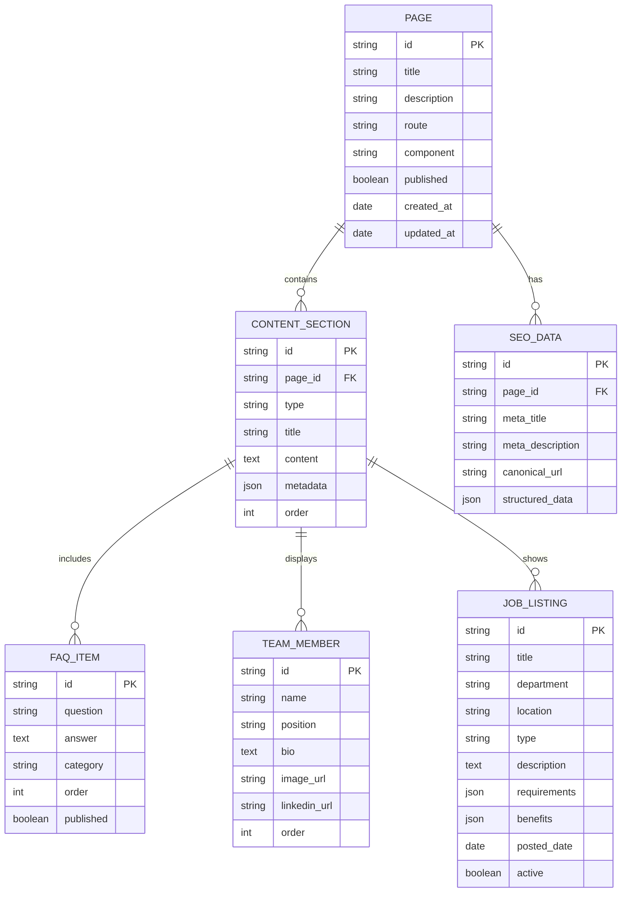

# MobiRides Missing Pages Technical Architecture

## 1. Architecture Design



## 2. Technology Description

- Frontend: React@18 + TypeScript + Tailwind CSS + Vite
- Routing: React Router DOM v6
- UI Components: Radix UI + Lucide React Icons
- SEO: React Helmet Async
- State Management: React Hooks (useState, useEffect, useMemo)
- Build Tool: Vite with TypeScript support
- Styling: Tailwind CSS with custom component classes

## 3. Route Definitions

| Route | Purpose | Component | Priority |
|-------|---------|-----------|----------|
| /about | About Us page with company information | AboutPage | High |
| /safety | Safety protocols and procedures | SafetyPage | High |
| /careers | Job listings and company culture | CareersPage | High |
| /press | Press releases and media resources | PressPage | High |
| /help | Help center with FAQ and support | HelpCenterPage | High |
| /pricing | Detailed pricing and calculator | PricingPage | High |
| /insurance | Insurance coverage details | InsurancePage | High |
| /support | Contact and support options | SupportPage | High |
| /travel-guides | Botswana travel information | TravelGuidesPage | Medium |
| /business | Enterprise solutions | BusinessSolutionsPage | Medium |
| /api-docs | Developer documentation | ApiDocsPage | Medium |
| /host-requirements | Host verification requirements | HostRequirementsPage | Medium |
| /host-protection | Host insurance and protection | HostProtectionPage | Medium |
| /host-community | Host community features | HostCommunityPage | Medium |

## 4. Component Architecture

### 4.1 Core Layout Components (Existing)

```typescript
// PageLayout.tsx - Main page wrapper
interface PageLayoutProps {
  children: React.ReactNode;
  title: string;
  description: string;
  canonical?: string;
  jsonLd?: object;
}

// PageHero.tsx - Hero section component
interface PageHeroProps {
  title: string;
  subtitle?: string;
  ctaText?: string;
  ctaLink?: string;
  backgroundImage?: string;
  variant?: 'default' | 'centered' | 'minimal';
}

// SectionWrapper.tsx - Content section wrapper
interface SectionWrapperProps {
  children: React.ReactNode;
  background?: 'white' | 'gray' | 'blue' | 'gradient';
  padding?: 'small' | 'medium' | 'large';
  id?: string;
}
```

### 4.2 New Reusable Components

```typescript
// FAQSection.tsx - Expandable FAQ component
interface FAQItem {
  id: string;
  question: string;
  answer: string;
  category?: string;
}

interface FAQSectionProps {
  items: FAQItem[];
  searchable?: boolean;
  categories?: string[];
  defaultExpanded?: string[];
}

// ContactForm.tsx - Multi-purpose contact form
interface ContactFormProps {
  type: 'general' | 'support' | 'business' | 'host';
  onSubmit: (data: ContactFormData) => void;
  showSubject?: boolean;
  showPriority?: boolean;
}

// PricingCalculator.tsx - Interactive pricing tool
interface PricingCalculatorProps {
  vehicleTypes: VehicleType[];
  locations: Location[];
  onCalculate: (params: CalculationParams) => PricingResult;
}

// TeamGrid.tsx - Team member display
interface TeamMember {
  id: string;
  name: string;
  position: string;
  bio: string;
  image: string;
  linkedin?: string;
}

interface TeamGridProps {
  members: TeamMember[];
  columns?: 2 | 3 | 4;
  showBio?: boolean;
}

// JobListing.tsx - Job posting component
interface Job {
  id: string;
  title: string;
  department: string;
  location: string;
  type: 'full-time' | 'part-time' | 'contract';
  description: string;
  requirements: string[];
  benefits: string[];
  postedDate: string;
}

interface JobListingProps {
  jobs: Job[];
  filters?: JobFilters;
  onApply: (jobId: string) => void;
}

// DocumentDownload.tsx - File download component
interface Document {
  id: string;
  title: string;
  description: string;
  fileUrl: string;
  fileSize: string;
  fileType: 'pdf' | 'doc' | 'zip';
}

interface DocumentDownloadProps {
  documents: Document[];
  category?: string;
  layout?: 'grid' | 'list';
}
```

### 4.3 Page-Specific Components

```typescript
// SafetyProtocols.tsx - Safety information display
interface SafetyProtocol {
  id: string;
  title: string;
  description: string;
  icon: string;
  steps?: string[];
}

// InsuranceCoverage.tsx - Insurance details component
interface CoverageItem {
  type: string;
  coverage: string;
  limit: string;
  deductible?: string;
}

// TravelDestination.tsx - Destination showcase
interface Destination {
  id: string;
  name: string;
  description: string;
  image: string;
  highlights: string[];
  bestTime: string;
  distance: string;
}

// APIEndpoint.tsx - API documentation display
interface APIEndpoint {
  method: 'GET' | 'POST' | 'PUT' | 'DELETE';
  path: string;
  description: string;
  parameters: Parameter[];
  responses: Response[];
  examples: CodeExample[];
}
```

## 5. Data Model

### 5.1 Data Structure Definition



### 5.2 JSON Data Files Structure

```typescript
// src/data/team-members.json
interface TeamMembersData {
  members: {
    id: string;
    name: string;
    position: string;
    bio: string;
    image: string;
    linkedin?: string;
    order: number;
  }[];
}

// src/data/job-listings.json
interface JobListingsData {
  jobs: {
    id: string;
    title: string;
    department: string;
    location: string;
    type: 'full-time' | 'part-time' | 'contract';
    description: string;
    requirements: string[];
    benefits: string[];
    postedDate: string;
    active: boolean;
  }[];
  departments: string[];
  locations: string[];
}

// src/data/faq-data.json
interface FAQData {
  categories: {
    id: string;
    name: string;
    description: string;
  }[];
  items: {
    id: string;
    question: string;
    answer: string;
    category: string;
    tags: string[];
    order: number;
  }[];
}

// src/data/travel-destinations.json
interface TravelDestinationsData {
  destinations: {
    id: string;
    name: string;
    description: string;
    image: string;
    highlights: string[];
    bestTime: string;
    distance: string;
    coordinates: {
      lat: number;
      lng: number;
    };
    activities: string[];
  }[];
  regions: string[];
}

// src/data/api-endpoints.json
interface APIDocsData {
  baseUrl: string;
  version: string;
  authentication: {
    type: string;
    description: string;
  };
  endpoints: {
    id: string;
    method: string;
    path: string;
    description: string;
    parameters: {
      name: string;
      type: string;
      required: boolean;
      description: string;
    }[];
    responses: {
      code: number;
      description: string;
      example: object;
    }[];
    category: string;
  }[];
}
```

## 6. SEO Implementation

### 6.1 Meta Tags Configuration

```typescript
// SEO configuration for each page
interface SEOConfig {
  title: string;
  description: string;
  keywords: string[];
  canonical: string;
  openGraph: {
    title: string;
    description: string;
    image: string;
    url: string;
  };
  structuredData: object;
}

// Example SEO configurations
const seoConfigs: Record<string, SEOConfig> = {
  '/about': {
    title: 'About MobiRides - Premium Car Sharing in Botswana',
    description: 'Learn about MobiRides mission to provide safe, reliable car sharing services across Botswana. Meet our team and discover our commitment to mobility.',
    keywords: ['about mobirides', 'car sharing botswana', 'company mission'],
    canonical: 'https://mobirides.com/about',
    openGraph: {
      title: 'About MobiRides - Premium Car Sharing in Botswana',
      description: 'Learn about MobiRides mission and team',
      image: 'https://mobirides.com/images/about-og.jpg',
      url: 'https://mobirides.com/about'
    },
    structuredData: {
      '@context': 'https://schema.org',
      '@type': 'AboutPage',
      'mainEntity': {
        '@type': 'Organization',
        'name': 'MobiRides',
        'description': 'Premium car sharing platform in Botswana'
      }
    }
  }
  // ... other page configurations
};
```

### 6.2 Structured Data Implementation

```typescript
// Structured data schemas for different page types
const structuredDataSchemas = {
  organization: {
    '@context': 'https://schema.org',
    '@type': 'Organization',
    'name': 'MobiRides',
    'url': 'https://mobirides.com',
    'logo': 'https://mobirides.com/logo.png',
    'contactPoint': {
      '@type': 'ContactPoint',
      'telephone': '+267-123-4567',
      'contactType': 'customer service'
    }
  },
  
  faqPage: {
    '@context': 'https://schema.org',
    '@type': 'FAQPage',
    'mainEntity': [] // populated with FAQ items
  },
  
  jobPosting: {
    '@context': 'https://schema.org',
    '@type': 'JobPosting',
    'hiringOrganization': {
      '@type': 'Organization',
      'name': 'MobiRides'
    }
  }
};
```

## 7. Performance Optimization

### 7.1 Code Splitting Strategy

```typescript
// Lazy loading for page components
const AboutPage = lazy(() => import('./pages/AboutPage'));
const SafetyPage = lazy(() => import('./pages/SafetyPage'));
const CareersPage = lazy(() => import('./pages/CareersPage'));
// ... other pages

// Route configuration with Suspense
<Route 
  path="/about" 
  element={
    <Suspense fallback={<PageSkeleton />}>
      <AboutPage />
    </Suspense>
  } 
/>
```

### 7.2 Asset Optimization

- Image optimization with WebP format and lazy loading
- CSS purging with Tailwind CSS
- JavaScript minification and tree shaking
- Font optimization with font-display: swap

### 7.3 Caching Strategy

- Static assets cached with long-term headers
- JSON data files cached with versioning
- Service worker for offline functionality (optional)

## 8. Accessibility Implementation

### 8.1 WCAG 2.1 Compliance

- Semantic HTML structure
- ARIA labels and roles
- Keyboard navigation support
- Screen reader compatibility
- Color contrast compliance (4.5:1 ratio)

### 8.2 Accessibility Features

```typescript
// Example accessible component implementation
const AccessibleFAQ: React.FC<FAQProps> = ({ items }) => {
  return (
    <div role="region" aria-labelledby="faq-heading">
      <h2 id="faq-heading">Frequently Asked Questions</h2>
      {items.map((item, index) => (
        <div key={item.id} className="faq-item">
          <button
            aria-expanded={expandedItems.includes(item.id)}
            aria-controls={`faq-answer-${item.id}`}
            onClick={() => toggleItem(item.id)}
          >
            {item.question}
          </button>
          <div
            id={`faq-answer-${item.id}`}
            role="region"
            aria-labelledby={`faq-question-${item.id}`}
          >
            {item.answer}
          </div>
        </div>
      ))}
    </div>
  );
};
```

## 9. Testing Strategy

### 9.1 Unit Testing

- Component testing with React Testing Library
- Hook testing with @testing-library/react-hooks
- Utility function testing with Jest

### 9.2 Integration Testing

- Page rendering tests
- Navigation flow testing
- Form submission testing
- API integration testing (if applicable)

### 9.3 E2E Testing

- User journey testing with Playwright or Cypress
- Cross-browser compatibility testing
- Mobile responsiveness testing
- Performance testing with Lighthouse

## 10. Deployment Configuration

### 10.1 Build Configuration

```typescript
// vite.config.ts updates
export default defineConfig({
  plugins: [react()],
  build: {
    rollupOptions: {
      output: {
        manualChunks: {
          vendor: ['react', 'react-dom'],
          router: ['react-router-dom'],
          ui: ['@radix-ui/react-accordion', '@radix-ui/react-dialog']
        }
      }
    }
  },
  resolve: {
    alias: {
      '@': path.resolve(__dirname, './src')
    }
  }
});
```

### 10.2 Environment Configuration

```typescript
// Environment variables for different deployments
interface EnvironmentConfig {
  VITE_APP_URL: string;
  VITE_API_BASE_URL?: string;
  VITE_CONTACT_FORM_ENDPOINT?: string;
  VITE_ANALYTICS_ID?: string;
  VITE_CHAT_WIDGET_ID?: string;
}
```

This technical architecture provides a comprehensive foundation for implementing all 16 missing pages while maintaining consistency, performance, and scalability for the MobiRides platform.